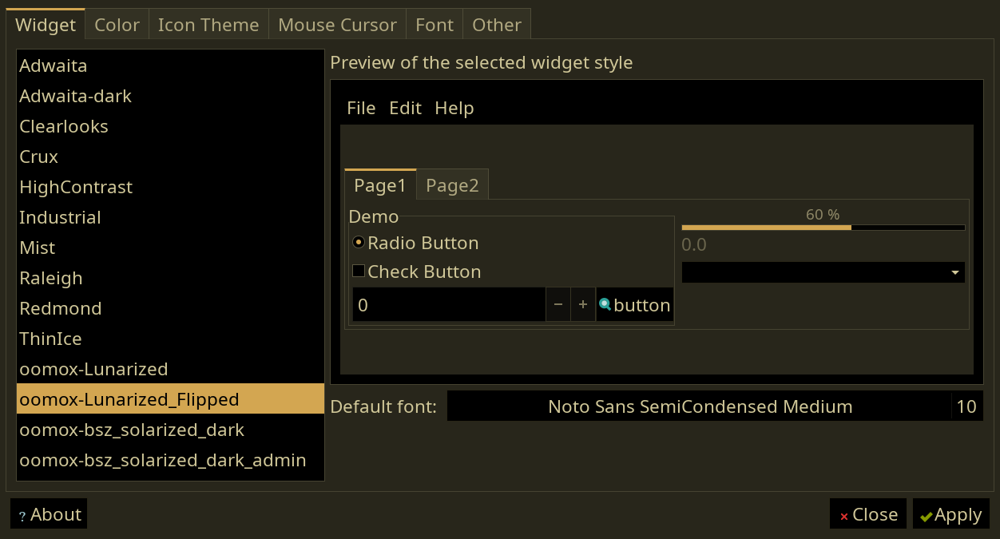

# GTK Lunarized
Unpack the folder inside theme.zip into ~/.themes/, and icons.zip into ~/.icons/

_flipped variants flip the textbox/menu and base background colors. Since many GTK applications display primarily the text/menu colors instead of the actual background color, this may look nicer. It's what I personally use.

### Regular

### Flipped

