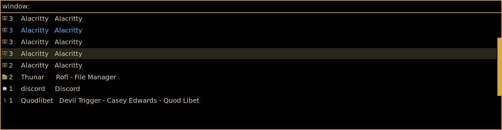

# Rofi Lunarized
Simply drop the rasi file into ~/.config/rofi and add `theme: "Lunarized";` to the configuration section of your rofi.rasi config file. The theme is pretty minimal, and parameters such as font/columns/size/etc should all be configued separately.

