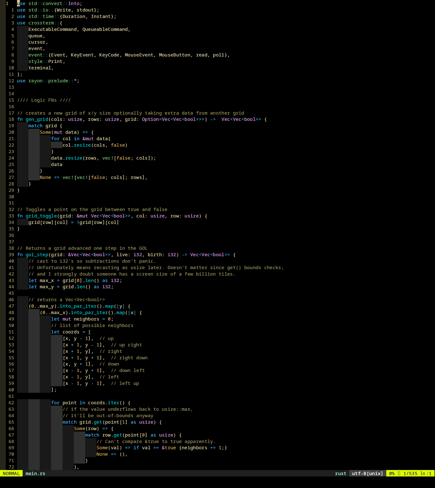

# [N]Vim Lunarized
Add Lunarized.vim to your colors/ folder in your vim data directory then simply append `colo Lunarized` to your vim config file. See `:help colorscheme` and `:help config`

This theme is still in-development and new highlight groups will be added regularly

