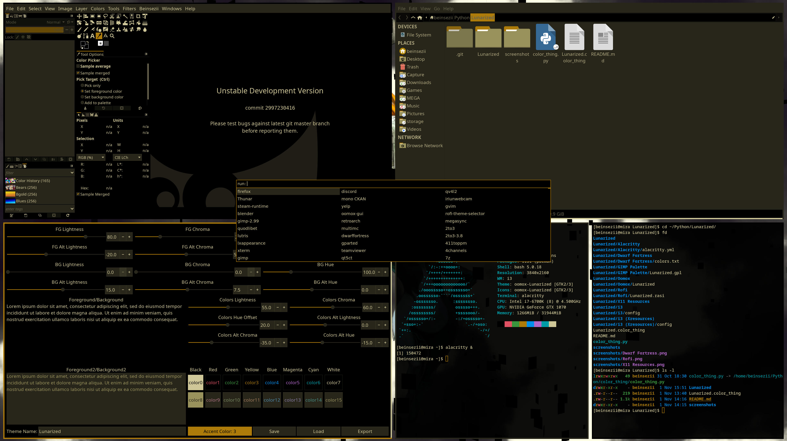

# Lunarized
For when Solarized is too hard on the eyes.

Currently unstable. Palette changes on the table.

### What..?
So I really like Solarized, but lately I've been more prone to headaches late at night, which is coincidentally when I do most of my programming. Solarized also has the hidden detriment that it fights low blue light filters, as it's basically pure blue.

So, I've decided to start work on Lunarized. It takes a similar 'highly functional' approach to Solarized, with a few key goals in mind:
 * Use yellow base instead of blue base. Work *with* blue light filters instead of against them.
 * Readability over style. Soft palettes this be not.
   * Still hopefully keep it not too avante-garde.
 * Black. Keep the base background pure black to help screen efficiency on oled/dynamic contrast displays. Think Android dark mode.
 * Compatibility. Not Solarized levels, but at least cover most of my own workflow.

### Okay show me

